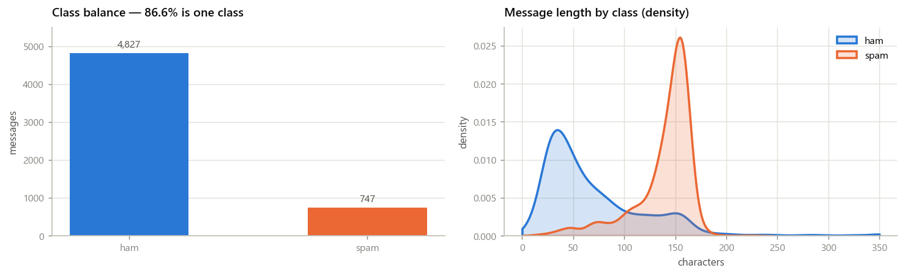
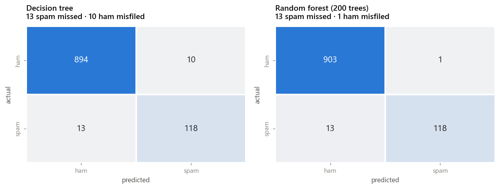
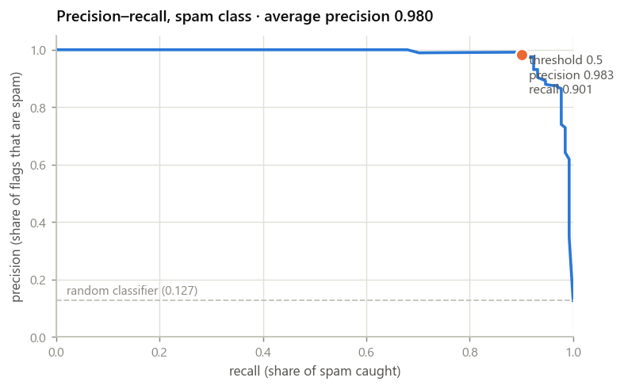
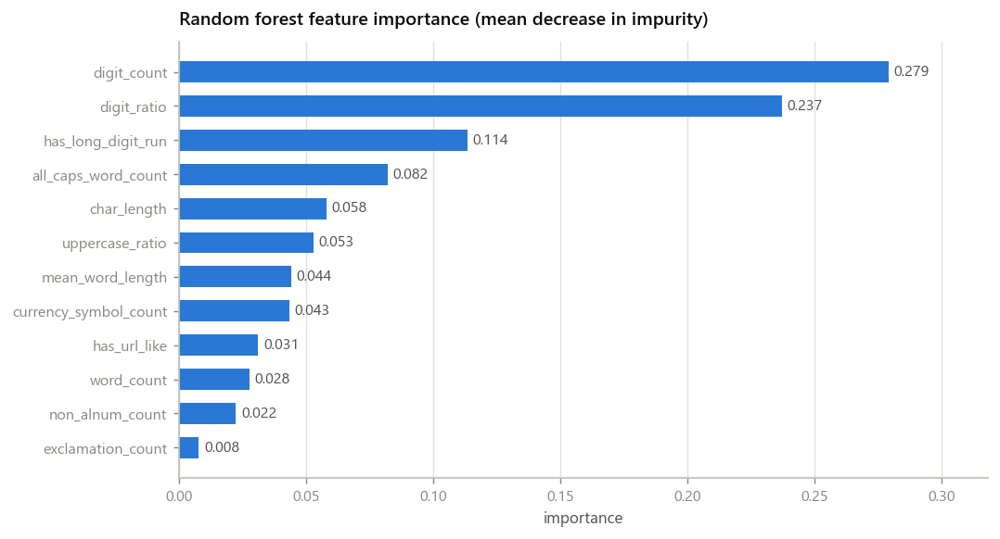
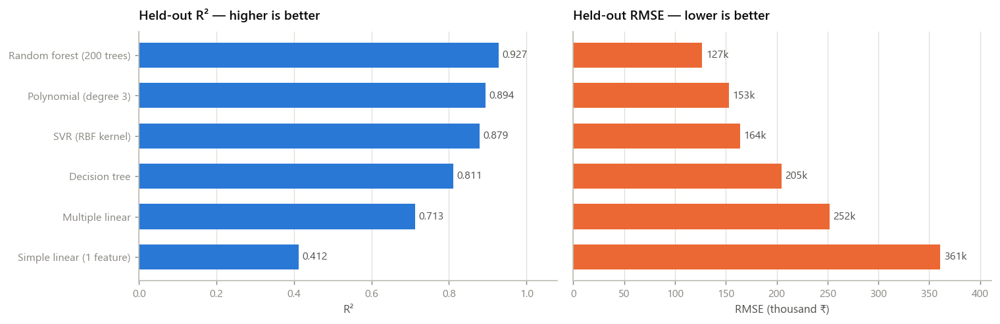
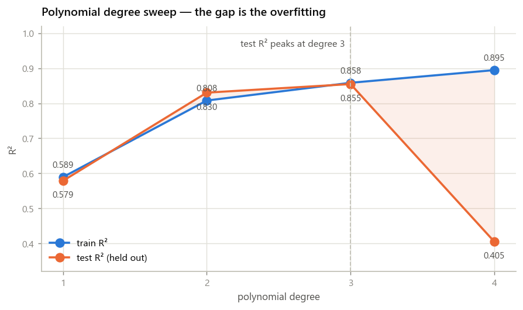

# Training Portfolio — Classical ML

Two machine-learning projects and three supporting utilities, built with classical ML
only: pandas, numpy, scikit-learn, matplotlib, seaborn. No deep learning frameworks.

| | |
|---|---|
| **Project 1** | SMS spam classification from 12 hand-engineered shape features |
| **Project 2** | Six regression families compared through one preprocessing template |
| **Utility 1** | Preprocessing template where train/test leakage is structurally impossible |
| **Utility 2** | Encoding-safe CSV loader that reports which encoding it used |
| **Utility 3** | CLI log parser with explicit encoding handling |
| **Tests** | 182 pytest tests |

---

## Contents

- [Setup](#setup)
- [Repository layout](#repository-layout)
- [Running the notebooks](#running-the-notebooks)
- [Running the utilities](#running-the-utilities)
- [Results](#results)
- [The three utilities](#the-three-utilities)
- [Two things worth reading the code for](#two-things-worth-reading-the-code-for)
- [Tests](#tests)
- [Notes and deviations](#notes-and-deviations)

---

## Setup

### Requirements

Python 3.11 is the target. **This repo was built and verified on Python 3.10.4**, which
is what the development machine had; nothing in the stack behaves differently across the
two, and `pyproject.toml` declares `requires-python = ">=3.10"`. See
[Notes and deviations](#notes-and-deviations).

### Install

```bash
git clone <repo-url>
cd "Field Training"

python -m venv .venv

# Windows
.venv\Scripts\activate
# macOS / Linux
source .venv/bin/activate

pip install -r requirements.txt
```

### Fetch the data

`data/` is gitignored — the SMS corpus contains real phone numbers and names, and both
files are reproducible from their public sources.

```bash
python scripts/download_data.py
```

```
       downloaded  SMS Spam Collection: SMSSpamCollection.tsv (477,907 bytes)
       downloaded  Used-car listings: car_details_v3.csv (1,041,637 bytes)
```

| Dataset | Source | Shape |
|---|---|---|
| SMS Spam Collection v.1 | [UCI ML Repository](https://archive.ics.uci.edu/dataset/228/sms+spam+collection) | 5,574 messages · 747 spam / 4,827 ham |
| CarDekho used-car listings | [GitHub mirror](https://raw.githubusercontent.com/swetaswarupa/Car-Price-Prediction/main/Car%20details%20v3.csv) | 8,128 rows × 13 columns |

Add `--force` to re-download, `--only sms` or `--only cars` to fetch one.

### Verify

```bash
pytest
```

---

## Repository layout

```
├── src/
│   ├── preprocessing/
│   │   └── template.py            # leakage-proof fit/transform/fit_transform
│   ├── utils/
│   │   ├── loader.py              # encoding-safe CSV/text loader
│   │   ├── log_parser.py          # CLI log parser
│   │   ├── redaction.py           # PII redaction for printed samples
│   │   └── plotstyle.py           # shared chart styling, CVD-validated palette
│   ├── features/
│   │   ├── spam_features.py       # the 12 SMS features
│   │   └── car_features.py        # used-car column cleaning
│   └── models/
│       └── regression_comparison.py   # six families + --data CLI
├── notebooks/
│   ├── 01_spam_eda.ipynb
│   ├── 02_spam_model.ipynb
│   └── 03_regression_comparison.ipynb
├── tests/                         # 182 tests
├── scripts/
│   ├── download_data.py           # fetch both datasets into data/
│   └── export_figures.py          # regenerate the figures used in this README
├── assets/                        # README figures (committed)
├── data/                          # gitignored
├── requirements.txt
└── pyproject.toml
```

---

## Running the notebooks

Run them in order — 02 builds on findings established in 01.

```bash
jupyter notebook          # then open notebooks/ and Run All
```

Or execute headlessly:

```bash
jupyter nbconvert --to notebook --execute --inplace notebooks/01_spam_eda.ipynb
jupyter nbconvert --to notebook --execute --inplace notebooks/02_spam_model.ipynb
jupyter nbconvert --to notebook --execute --inplace notebooks/03_regression_comparison.ipynb
```

All three are committed **with outputs**, so they are readable without running anything.
Every notebook follows the same section order — imports → data loading → EDA →
preprocessing → modelling → evaluation — with each section under a markdown heading, and
a markdown cell recording the reason for every non-obvious parameter choice at the point
the choice is made.

| Notebook | What it does | Runtime |
|---|---|---|
| `01_spam_eda.ipynb` | Class balance, length histograms by class, digit- and uppercase-ratio distributions, duplicate analysis, univariate separation ranking | ~30s |
| `02_spam_model.ipynb` | 12 features → label encode → stratified split → scale → decision tree + random forest → spam-class metrics, importances, LIMITATIONS | ~40s |
| `03_regression_comparison.ipynb` | Six regression families through one template, R²/RMSE table, degree-4 overfitting demo | ~3min |

`03` runs a `--data` equivalent: set `DATA_PATH` in the imports cell to point at another CSV.

---

## Running the utilities

### Regression comparison (CLI)

```bash
python -m src.models.regression_comparison
python -m src.models.regression_comparison --data path/to/other.csv --target price --no-clean
```

| Flag | Default | Meaning |
|---|---|---|
| `--data` | `data/car_details_v3.csv` | CSV to model |
| `--target` | `selling_price` | Target column |
| `--random-state` | `42` | Split seed |
| `--max-categories` | `20` | One-hot width cap per categorical column |
| `--no-clean` | off | Skip the used-car-specific column cleaning |

### Regenerate the README figures

```bash
python scripts/export_figures.py
```

The notebooks store their charts as base64 inside the `.ipynb`, which markdown cannot
reference, so `assets/` holds the same figures as files. This script re-runs both
pipelines and re-plots rather than copying stale images out of the notebooks, so the
README figures cannot silently drift from the results the notebooks produce.

### Log parser (CLI)

```bash
python -m src.utils.log_parser tests/fixtures/sample.log --top 5
python -m src.utils.log_parser app.log --json --encoding utf-8
```

```
====================================================================================================
LOG SUMMARY  tests/fixtures/sample.log
====================================================================================================
  encoding used      : latin-1
  total lines        : 942
  blank lines        : 21
  lines w/o a level  : 21

LEVEL COUNTS
  CRITICAL       24    2.7%  #
  ERROR          88    9.8%  ####
  WARNING       144   16.0%  ######
  INFO          539   59.9%  ########################
  DEBUG         105   11.7%  #####

TOP ERROR MESSAGES  (112 error-level lines)
   1. [   34x]  Connection timeout connecting to db-57 at 10.0.0.6:5432 after 30000ms
   2. [   27x]  Failed to parse payload for order_id=884212: unexpected token
   3. [   27x]  Upload rejected: file 'rapport_financière.csv' exceeds 25 MB limit
   4. [   24x]  Disk usage 928% on /var/log -- shedding load
====================================================================================================
```

---

## Results

### Project 1 — SMS spam classification

Held-out test set: **1,035 messages, 131 spam.** 5,574 messages → 5,171 after dropping
403 exact duplicates → stratified 80/20 split, `random_state=42`.



The left panel is the fact that governs every metric choice below. The right panel is
why shape features work at all: ham peaks near 35 characters with a long tail, spam
clusters tightly at ~150 — written to fill the 160-character SMS limit.

**Headline metrics are precision, recall and F1 for the SPAM class.**

| Model | Precision (spam) | Recall (spam) | **F1 (spam)** | Accuracy |
|---|---|---|---|---|
| **Random forest (200 trees)** | **0.9916** | **0.9008** | **0.9440** | 0.9865 |
| Decision tree | 0.9219 | 0.9008 | 0.9112 | 0.9778 |
| *Baseline (predict `ham` always)* | *0.0000* | *0.0000* | *0.0000* | *0.8734* |

> **Accuracy is near-meaningless here and is listed only to be dismissed.** 86.6% of the
> corpus is `ham`. The baseline row shows the consequence: predicting `ham` for every
> message scores **87.3% accuracy while catching zero spam**. Nearly all of the forest's
> 98.7% is free. Only the three spam-class columns are worth reading.
>
> For further scale: notebook 01 finds that a **single-threshold rule on `digit_count`
> alone reaches spam F1 0.897**. The twelve-feature forest adds ~4.7 points on top of that.

#### Confusion matrices



Worth reading side by side: **both models miss the exact same 13 spam messages.** The
entire difference between them is false positives — the tree misfiles 10 legitimate
messages, the forest misfiles 1. That is the whole precision gap (0.9219 → 0.9916), and
it lands on the error type that actually costs a user something: a real message diverted
to the spam folder is a missed appointment, while a spam message reaching the inbox is
an annoyance.

The shared 13 misses are the recall ceiling described in the limitations — spam that
looks like ordinary text on all twelve axes, which no amount of model capacity reaches.

#### Precision–recall trade-off



`class_weight` was left at `None` deliberately, so this curve — rather than a single
tuned number — is how the trade-off is presented. The 0.5 threshold is one point on it;
moving along the curve is a policy decision about the relative cost of the two error
types, not a modelling one.

#### Feature importances



Mean decrease in impurity — top 3 account for 63.0%:

| Rank | Feature | Importance |
|---|---|---|
| 1 | `digit_count` | 0.2793 |
| 2 | `digit_ratio` | 0.2372 |
| 3 | `has_long_digit_run` | 0.1136 |
| 4 | `all_caps_word_count` | 0.0820 |
| 5 | `char_length` | 0.0582 |

The remaining seven: `uppercase_ratio`, `mean_word_length`, `currency_symbol_count`,
`has_url_like`, `word_count`, `non_alnum_count`, `exclamation_count`.

> Impurity-based importance is biased toward high-cardinality features — a continuous
> column offers a tree far more candidate split points than a binary flag, so the flags
> here are understated relative to what they contribute. Read the ranking as indicative.

**Limitations** are written up in full in notebook 02 §7. In short: the features capture
message *shape* and never word identity, which caps recall at ~0.90 — the missed spam is
the spam that reads like ordinary text, and no amount of extra data fixes it. The currency
and uppercase features assume English and Latin script; on Arabic they are undefined
(unicameral script, so `uppercase_ratio` reads 0 for everything), and on **Arabizi** the
digit-for-letter substitution (`3`→ع, `7`→ح) makes ordinary conversation look digit-heavy
to the two strongest features in the model, pushing legitimate messages toward false
positives.

### Project 2 — Regression family comparison

Held-out test set: **1,382 listings.** 8,128 rows → 6,907 after dropping 1,221 exact
duplicates → 80/20 split, `random_state=42`. All six estimators receive the **identical
split and identical fitted preprocessing**, so the estimator is the only variable.

| Model | Features | **Test R²** | **Test RMSE** | Train R² | R² gap |
|---|---|---|---|---|---|
| **Random forest (200 trees)** | 33 | **0.9274** | **₹126,770** | 0.9858 | 0.0584 |
| Polynomial (degree 3) | 33 | 0.8942 | ₹152,998 | 0.9136 | 0.0194 |
| SVR (RBF kernel) | 33 | 0.8788 | ₹163,774 | 0.9805 | 0.1017 |
| Decision tree | 33 | 0.8106 | ₹204,689 | 0.9992 | 0.1886 |
| Multiple linear | 33 | 0.7131 | ₹251,967 | 0.7297 | 0.0167 |
| Simple linear (`max_power`) | 1 | 0.4115 | ₹360,829 | 0.4864 | 0.0749 |



*Two panels rather than a dual-axis chart: R² and RMSE have different units and opposite
polarity, and sharing one baseline would invite exactly the misreading dual-axis charts
are notorious for. The row order is shared so the eye can compare across both.*

**Flexibility does not order these results**, and notebook 03 §6.2 works through why. A
degree-3 polynomial beats both the SVR and an unpruned decision tree — the most flexible
hypothesis class in the table. What orders them is the bias–variance trade-off, and the
`R² gap` column is the variance term: the decision tree fits training data to R² 0.9992
and gives 0.19 of it back. The forest and the single tree are the cleanest comparison
available, since the base learner is identical and the only difference is averaging 200
decorrelated copies.

#### Overfitting demonstration — polynomial degree sweep

Six strongest numeric features, degrees 1–4:

| Degree | Terms | Train R² | Test R² | **Gap** | Test RMSE |
|---|---|---|---|---|---|
| 1 | 6 | 0.5894 | 0.5788 | 0.0105 | ₹305,268 |
| 2 | 27 | 0.8077 | 0.8303 | −0.0226 | ₹193,773 |
| **3** | 83 | 0.8584 | **0.8547** | **0.0037** | **₹179,287** |
| **4** | 209 | **0.8946** | 0.4051 | **0.4895** | ₹362,803 |



**Degree 4 fits the training data better and the world worse.** Train R² rises
(0.8584 → 0.8946), so anyone watching only training performance would ship it. Test R²
collapses (0.8547 → 0.4051), the gap widens **134×**, and test RMSE rises by **₹183,516
per listing**. The mechanism is 2.5× the parameters (83 → 209 terms) fitted on the same
rows, finding noise rather than signal.

*(The slightly negative gap at degree 2 is split noise, not an artefact — see notebook 03.)*

---

## The three utilities

### 1. Preprocessing template — `src/preprocessing/template.py`

scikit-learn-style `fit` / `transform` / `fit_transform`, storing the fitted imputer,
encoder and scaler for reuse. **Train/test leakage is prevented by construction, not by
the caller remembering:**

```python
split = split_dataset(X, y, test_size=0.2, random_state=42, stratify=True)
prep = PreprocessingTemplate()
X_train = prep.fit_transform(split.train)     # only a TrainingPartition is accepted
X_test = prep.transform(split.test_X)         # reuses the fitted statistics
```

```python
>>> prep.fit(X)                    # the full dataset
TypeError: fit() takes a TrainingPartition, got DataFrame. Preprocessing statistics
must come from the training rows alone; fitting on a full frame or on the test frame
leaks held-out information into the model.

>>> TrainingPartition(X=X, y=y)    # forging one
TypeError: TrainingPartition() cannot be constructed directly -- that would
reintroduce the very mistake this type exists to prevent.

>>> prep.fit(split.train)          # re-fitting, e.g. on the test partition
AlreadyFittedError: This template is already fitted. Re-fitting would overwrite the
training statistics -- most often with the test partition's, which is leakage.
```

Handles unseen categories at transform time without crashing (`handle_unknown="ignore"`
encodes them all-zeros; `describe_unseen_categories()` makes that silent path visible),
coerces numeric columns that arrive as objects rather than failing the whole transform,
and offers `keep_columns` so de-duplication can use columns the model must never see.

### 2. Encoding-safe loader — `src/utils/loader.py`

```python
result = read_csv_safe("data/messages.csv")
result.encoding        # 'latin-1'
result.used_fallback   # True
print(result.describe())
# Loaded messages.csv: 5,574 rows x 2 cols using encoding 'latin-1' (fell back from utf-8)
```

Tries UTF-8, falls back to Latin-1, and **reports which one worked** rather than failing
silently or mangling characters. `errors="strict"` is load-bearing — a lenient handler
would make every candidate "succeed" while substituting U+FFFD for every non-ASCII byte.
Passing `encoding=` as a kwarg is rejected, since it would defeat the detection.
`EXTENDED_ENCODINGS` adds `utf-8-sig` and `cp1252` for BOM and Windows-1252 inputs.

### 3. Log parser — `src/utils/log_parser.py`

Line count, per-level counts, and the most frequent error messages. **Encoding is always
passed explicitly at read time** — never the platform default, which on Windows is still
a legacy ANSI codepage in many setups, so an unqualified `open()` decodes the same file
differently depending on where it runs.

Error messages are grouped after masking timestamps, hex ids, IPs, numbers and quoted
strings, and after dropping the dotted logger name — without that, one failure mode
reported by three components counts as three distinct errors and the real top error never
surfaces.

---

## Two things worth reading the code for

Both were found by the work rather than anticipated, and both are the kind of bug that
produces a *plausible* number rather than an error.

### The dummy-variable trap silently destroyed multiple linear regression

A full set of *k* one-hot dummies sums to 1 in every row, which is exactly collinear with
the intercept, so the design matrix loses one rank per categorical column. Measured on the
used-car data:

| | columns | rank (+intercept) | condition number | max abs. coefficient | test R² |
|---|---|---|---|---|---|
| `drop_first=False` | 37 | **34 of 38** | 1.7 × 10¹⁶ | 1.3 × 10¹⁷ | **−4.6 × 10¹⁷** |
| `drop_first=True` | 33 | 34 of 34 | 83 | 1.3 × 10⁶ | 0.713 |

Least squares inverted a near-singular matrix and produced coefficients of order 10¹⁷
that cancelled almost exactly on the training rows and exploded on unseen ones. **Train R²
stayed a plausible 0.73 throughout**, so nothing about the training fit signalled it — and
the tree models were entirely unaffected, which is what makes it easy to ship by accident.

### De-duplicating on features alone discarded 470 real observations

The regression pipeline was checking duplicates over feature columns only, so two listings
with the same specification but different asking prices counted as duplicates and one was
dropped — 1,691 rows removed where only 1,221 are genuine duplicates. Those are not
duplicates; they are two real observations that disagree, and that disagreement is exactly
the irreducible noise the model deserves to be scored against. Fixing it moved the
degree-3 polynomial from 0.7909 to 0.8942 and reordered the results table.

---

## Tests

```bash
pytest                        # 182 tests
pytest -W error::DeprecationWarning
pytest tests/test_template.py -v
```

| File | Covers |
|---|---|
| `test_template.py` | The four cases the brief specifies, one class each |
| `test_loader.py` | Encoding detection, fallback reporting, mangling prevention |
| `test_log_parser.py` | Level extraction, message normalisation, CLI exit codes |
| `test_spam_features.py` | All 12 features, robustness, redaction |
| `test_regression.py` | Car cleaning, six families, dummy trap, overfitting demo |

The four required template cases:

1. **Non-UTF-8 input** — a Latin-1 fixture reaches the template unmangled; the test also
   asserts that a *lenient* reader produces U+FFFD on the same file, so the guard is known
   to be load-bearing.
2. **Duplicate rows** — dropped before the split, target stays aligned. A companion test
   characterises the bug directly: with de-duplication skipped, rows *do* land on both
   sides of the split.
3. **Unseen categories at transform time** — no crash, all-zeros encoding, and the output
   column count stays stable (a widened test matrix would break every fitted estimator
   downstream).
4. **Scaler statistics come from the training partition** — asserts both halves of the
   claim: `scaler_.mean_` equals the train-partition mean **and** is measurably different
   from the full-dataset mean, so the test would actually fail if `fit()` ever saw
   everything. Same for the imputer median and the encoder categories.

---

## Notes and deviations

**Python version.** The brief specifies 3.11; this was built and verified on **3.10.4**,
the only interpreter on the development machine. Nothing in the stack (pandas, numpy,
scikit-learn, matplotlib, seaborn) behaves differently between the two, and no 3.11-only
syntax is used. `pyproject.toml` declares `requires-python = ">=3.10"`.

**The SMS file's encoding.** The brief describes the SMS Spam Collection as *"Latin-1
encoded, not UTF-8"*. **The UCI zip distribution is in fact valid UTF-8** — the loader
decodes it as UTF-8 and `£`, `é` and friends come through intact, with zero U+FFFD
replacement characters.

This is a distribution difference, not a contradiction. The widely-circulated Kaggle
mirror (`spam.csv`) *is* Latin-1/CP-1252 and does fail a strict UTF-8 read, which is why
nearly every tutorial using it passes `encoding='latin-1'` explicitly.

It is also precisely the case the loader exists for. Hard-coding either encoding would be
wrong for one of the two distributions — and hard-coding Latin-1 would have **silently
mojibaked this file**, since Latin-1 maps all 256 byte values and therefore never raises:
`£` would have become `£` with no error at all. Detecting and *reporting* is the only
approach correct for both. The Latin-1 path is exercised in `tests/test_loader.py` against
a fixture built for it, and in the log-parser fixture.

**Everything else follows the brief as written**: 12 features exactly, dedupe before split,
stratified 80/20 at `random_state=42`, scale after splitting, `n_estimators=200`,
spam-class headline metrics, all six regression families through one template, and the
degree-4 overfitting demonstration.
